# 信号量

## 一、背景

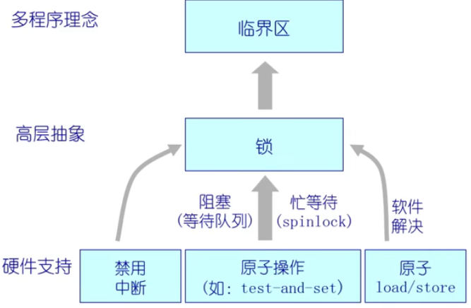

## 二、信号量

#### 抽象数据类型

一个整形（sem），两个原子操作

P()：sem减1，如果sem<0，等待（睡眠），否则继续

V()：sem加1，如果sem<=0，唤醒一个等待的P

## 三、信号量使用

**信号量是整数（有符号数）**

**信号量是被保护的变量**

​	1.初始化完成后，唯一改变一个信号量的值的办法是通过P()和V()

​	2.操作必须是原子

**P()能够阻塞，V()不会阻塞**

我们假定信号量“公平的”，以FIFO来管理等待

**两种类型信号量**

​	1.二进制信号量：可以是0或1

​	2.一般/计数信号量：可取任何非负值

​	3.两者相互表现（给定一个可以实现另一个）

**信号量可以用在2个方面**

​	1.互斥

​	2.条件同步（调度约束——一个线程等待另一个线程的事情发生）

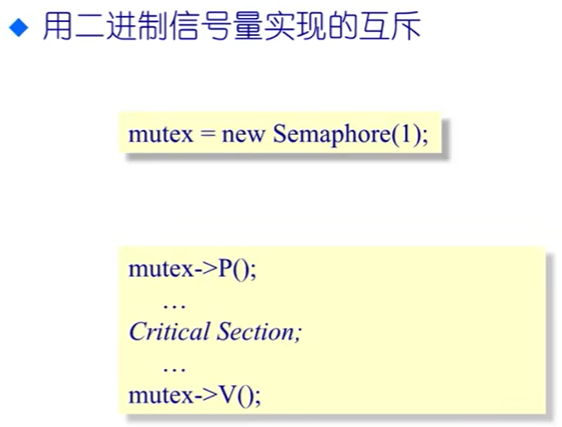

一种同步操作：

特殊同步：

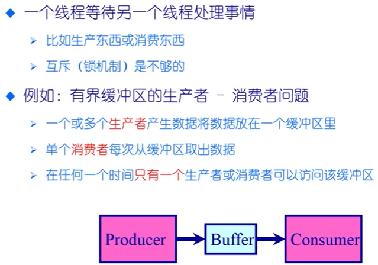

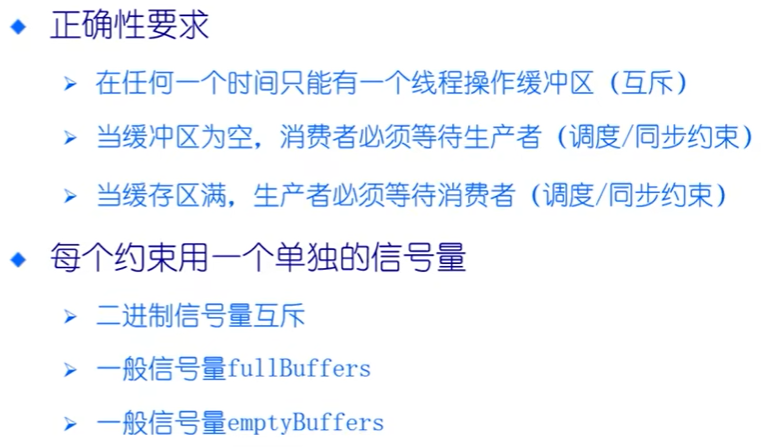

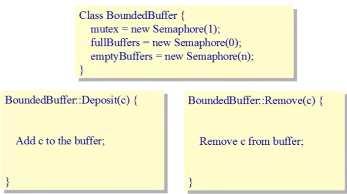

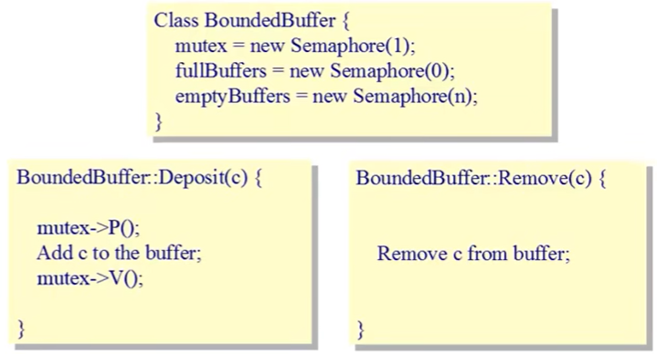

## 四、信号量的实现

​		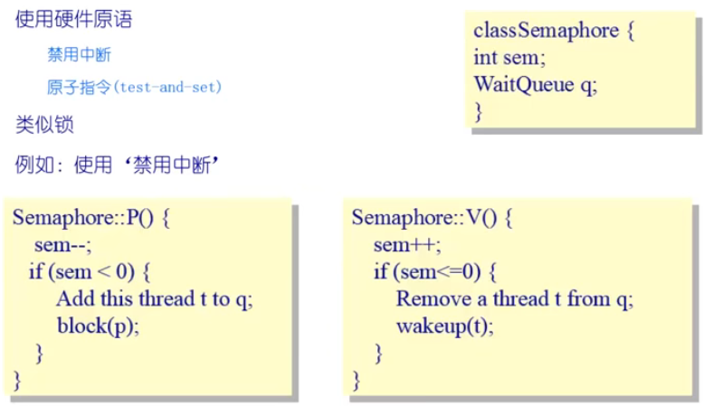

## 五、管程（更高的抽象程度）

 包含了一系列共享变量和针对这些变量的操作的函数的一个组合

**目的：**分离互斥和条件同步的关注

**什么是管程？**（设计当中）

​	1.一个锁：指定临界区     ——》确保互斥性

​	2.0或者多个条件变量：等待/通知信号量用于管理并发访问共享数据

**一般方法：**

​	1.收集在对象/模块中的相关共享数据

​	2.定义方法来访问共享数据

​	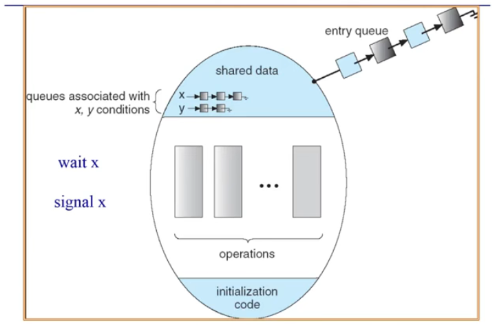

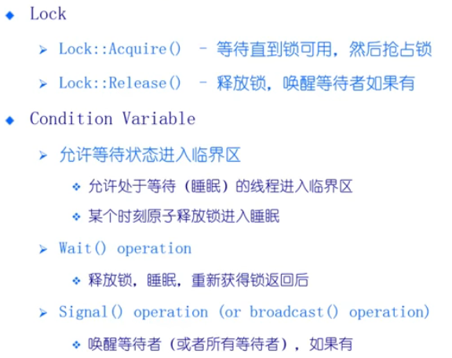

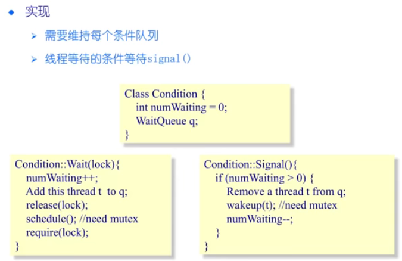

生产者，消费者问题 ：

 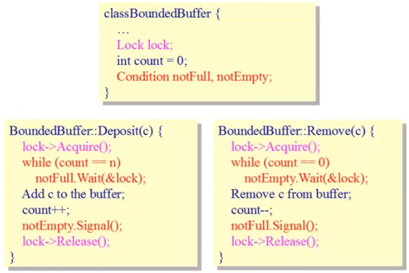

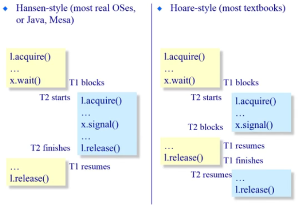

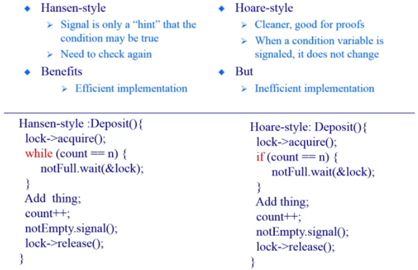

唤醒机制的实现方式不同；

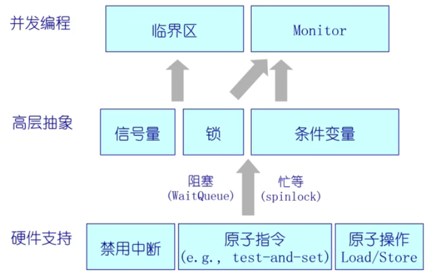

## 六、经典同步问题（如何使用信号量和管程）

### 1.读者-写着问题

**动机：**共享数据的访问

**两种类型使用者**

​	1.读者：不需要修改数据

​	2.写者：读取和修改数据

**问题的约束**

​	1.允许同一时间有多个读者，但在任何时候只有一个写者

​	2.当没有写者时，读者才能访问数据

​	3.当没有读者和写者时，写者才能访问数据

​	4.在任何时候只能有一个线程可以操作共享变量

**多个并发进程的数据集共享**

​	读者 ——只读数据集；他们不执行任何更新

​	写者 ——可以读取和写入

**共享数据**

​	1.数据集

​	2.信号量CountMutex初始化为1    （Rcount的读写互斥）

​	3.信号量WriteMutex初始化为1     （写者互斥）

​	4.整数Rcount初始化为0    （有多少个写者）

**读者**优先：（信号量的方法）

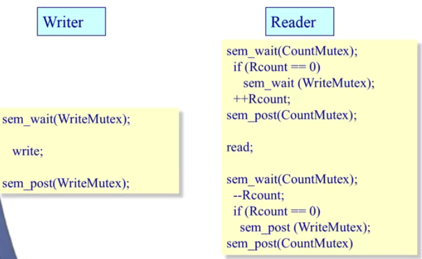

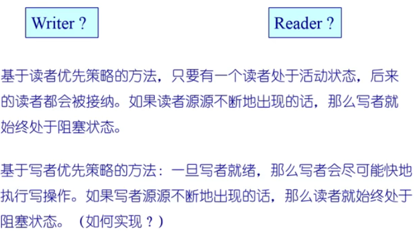

**写者**优先：（管程实现）

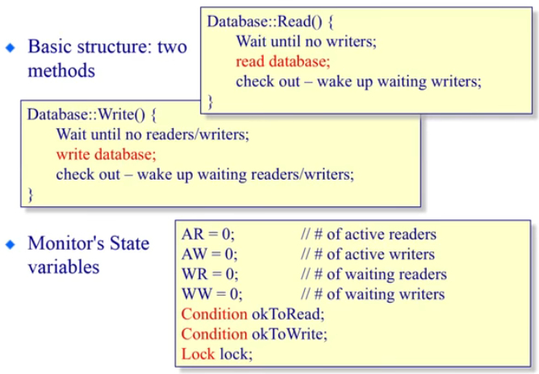

函数调用都是互斥的状态，所以需要lock

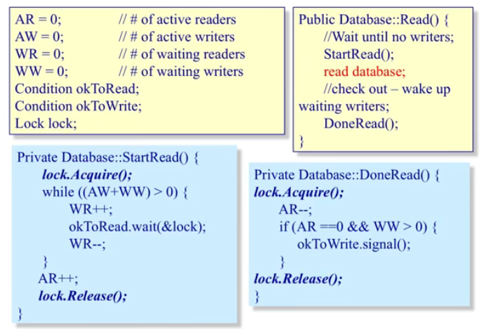

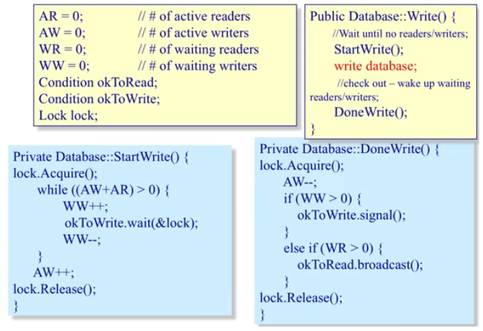

broadcast()唤醒所有

### 2.哲学家就餐问题

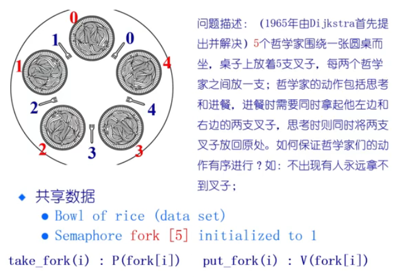

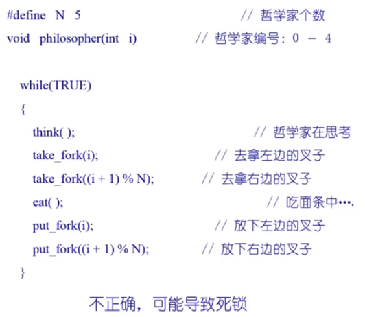

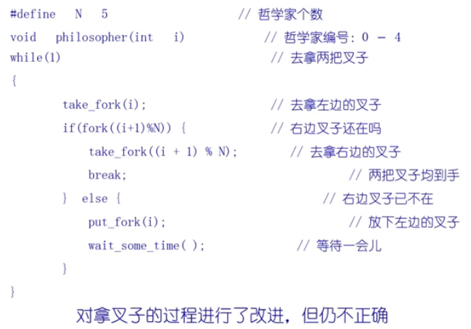

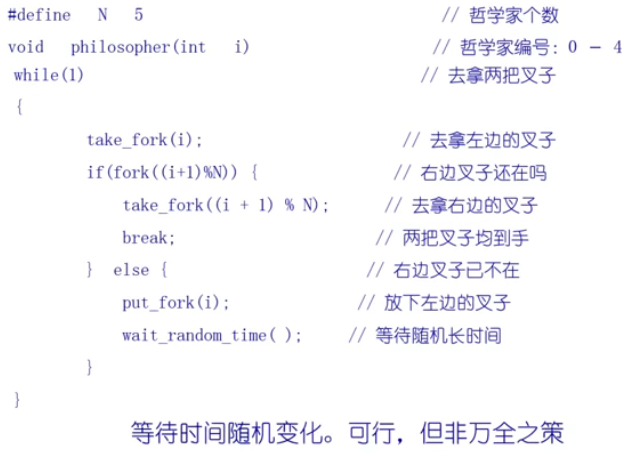

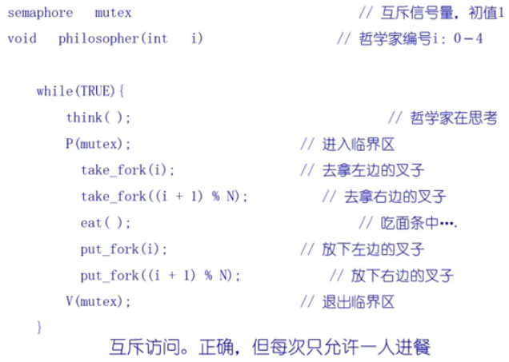

把就餐（而不是叉子）看成是必须互斥访问的临界资源，因此会造成（叉子）资源的浪费。

从理论上说，如果有五把叉子，应允许两个不相邻的哲学家同时进餐。

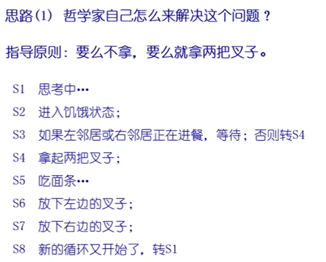

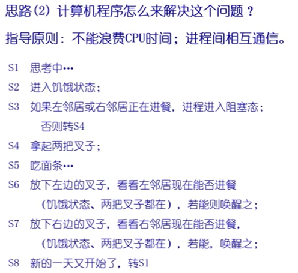

哲学家的状态成为**临界资源**

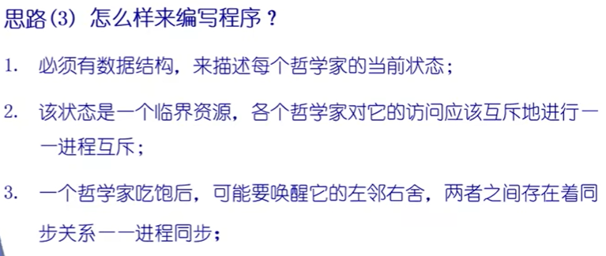

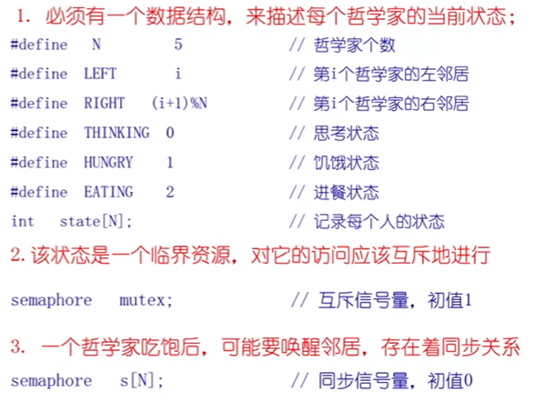

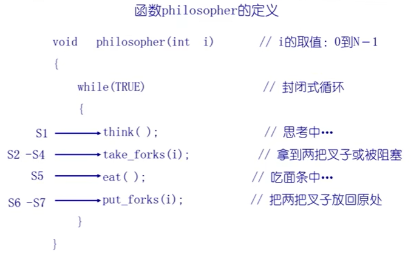

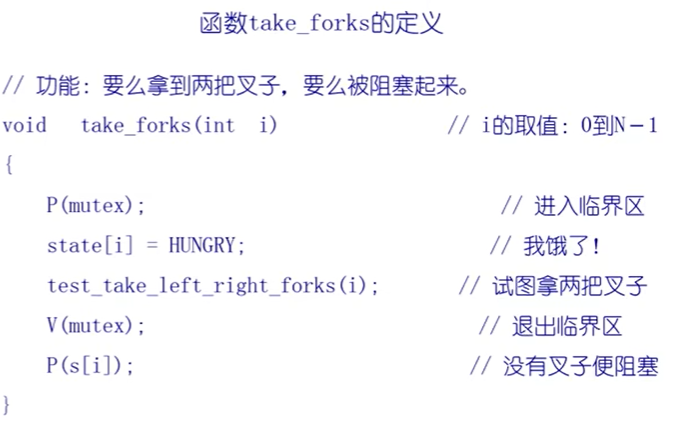

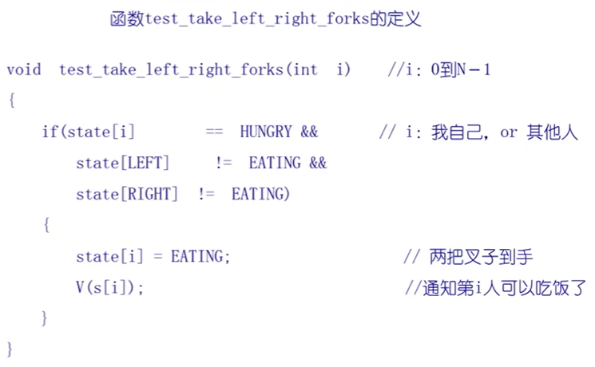

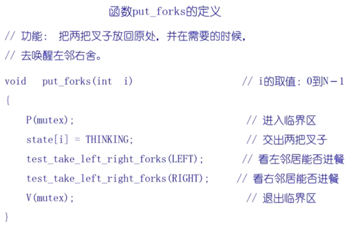

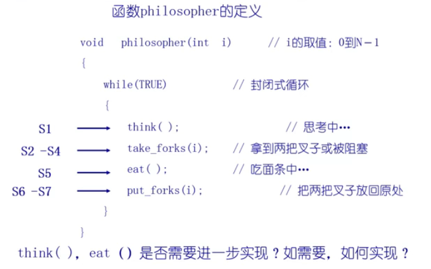

