# 同步

## 1.背景

多道程序设计：现代操作系统地重要特性

并行很有用（多个并发实体：CPU(s)，I/O，...，用户，...）

进程/线程：操作系统抽象出来用于支持多道程序设计

CPU调度：实现多道程序设计地机制

调度算法  - 不同的策略

协同多道程序设计的并发问题

**独立的线程：**

不和其他线程共享资源或状态

确定性-》输入状态决定结果

可重现-》能够重现起始条件，I/O

调度顺序不重要

**合作线程：**

在多个线程中共享状态

不确定性

不可重现

**不确定性和不可重现意味着Bug可能是间歇性发生**

为什么要合作？

解决不定性问题：

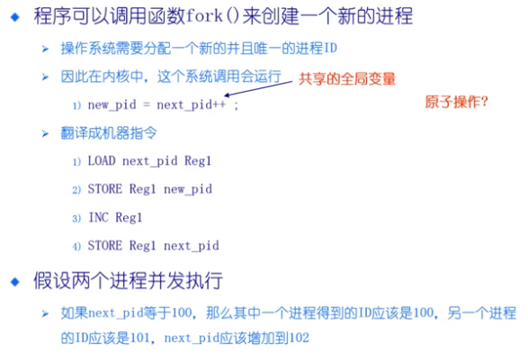

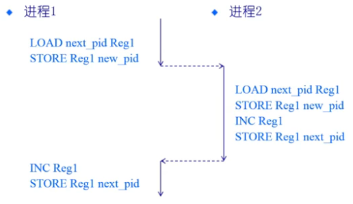

Reg1 :寄存器在上下文切换后恢复

## 2.一些概念

**Race Condition(竞态条件)**

系统缺陷：结果依赖于并发执行或事件的顺序/时间

​		不确定性，不可重现

**怎么避免竞态？**     让指令不被打断

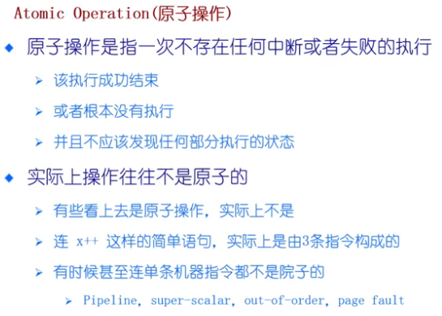

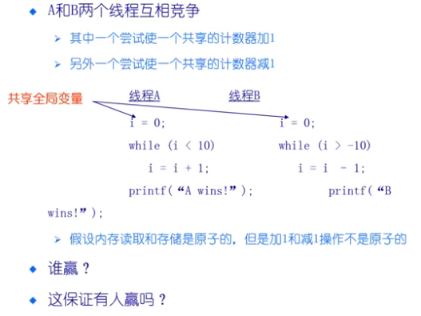

**临界区**是指进程中的一段需要访问共享资源并且另一个进程处于相应代码区域时便不会被执行的代码区域

（访问共享资源的代码）

**互斥（Mutual exclusion）**当一个进程处于临界区并访问共享资源时，没有其他进程会处于临界区并且访问任何相同的共享资源。

**死锁（Dead lock）**两个或以上的进程，在相互等待完成特定任务，而最终没法将自身任务进行下去

**饥饿（Starvation）**一个可执行的进程，被调度器持续忽略，以至于虽然处于可执行状态却不被执行

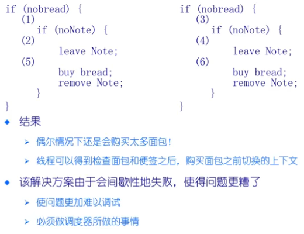

为便签增加标签？

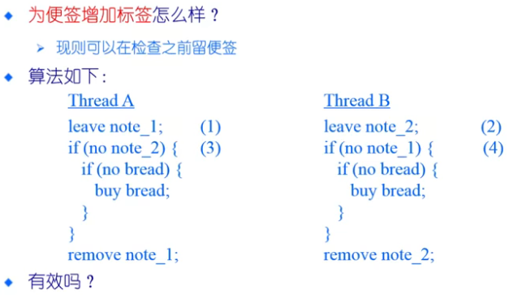

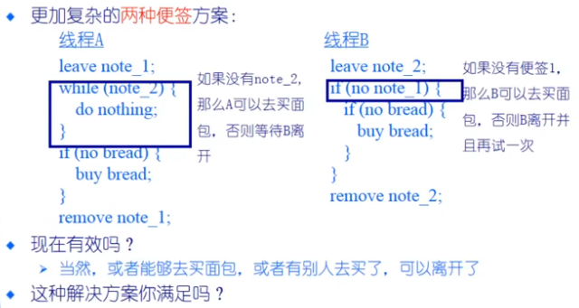

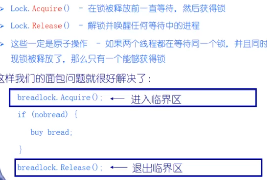

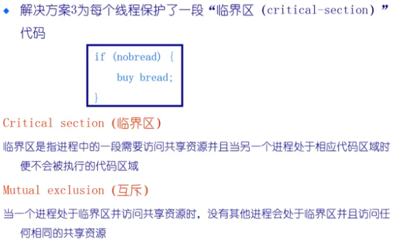

## 3.临界区（critical section）

互斥：同一时间临界区中最多存在一个线程/进程

Progress：如果一个线程想要进入临界区，那么它最终会成功

有限等待：如果一个线程i处于入口区，那么在i的请求被接受之前，其他线程进入临界区的时间是有限的

无忙等待（可选）：如果一个进程在等待进入临界区，那么在它可以进入之前会被挂起

## 4.方法1：禁用硬件中断

没有中断，没有上下文切换，因此没有并发

​	硬件将中断处理延迟到中断被启用后

​	大多数现代计算机体系结构都提供指令来完成

进入临界区

​	禁用中断

离开临界区

​	开启中断

一旦中断被禁用，线程就无法被停止

​	整个系统都为你停下

​	可能导致其他线程处于饥饿状态

要是临界区可以任意长？

​	无法限制响应中断所需的时间（可能存在硬件影响）

**要小心使用**

## 5.方法2：基于软件的解决方法   ——也用在分布式系统中

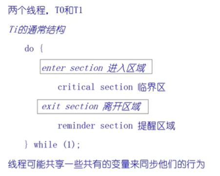

设计1：

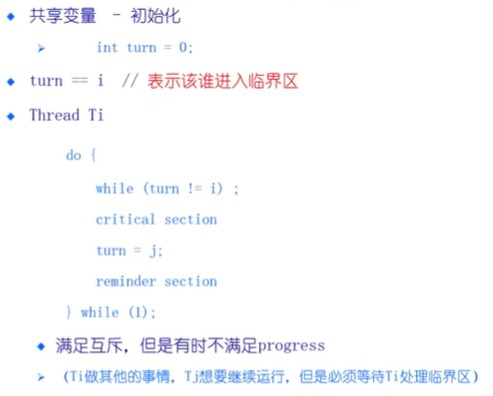

设计2：

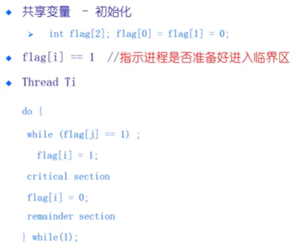

没有互斥；

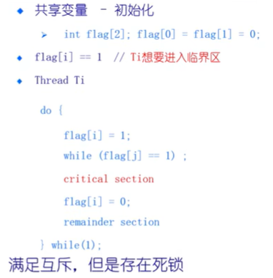

正确的方法：

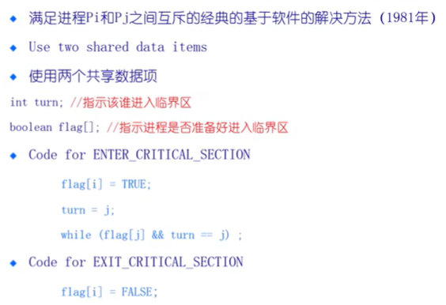

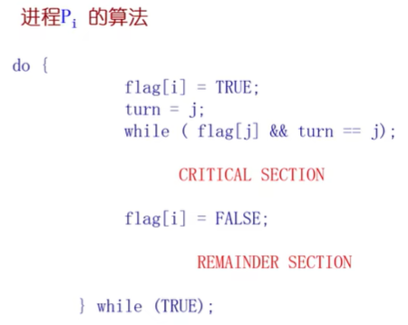

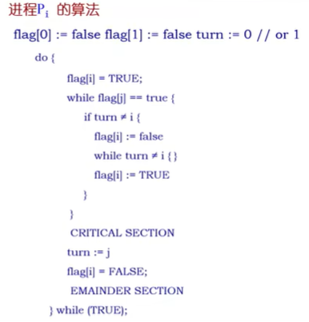

n个进程的互斥保护：

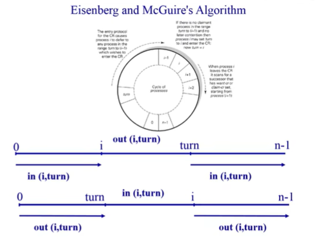

前进：不在临界区的进程不能阻止另一个进程进入临界区

## 6.方法3：更高级地抽象

**硬件提供了一些原语**

​	1.像中断禁用，原子操作指令等

​	2.大多数现代体系结构都这样

**操作系统提供更高级的编程抽象来简化并行编程**

​	1.例如：锁，信号量

​	2.从硬件原语中构建

**锁是一个抽象地数据结构**

​	1.一个二进制状态（锁定/解锁），两种方法

​	2.Lock::Acquire()   -- 锁被释放前一直等待，然后得到锁

​	3.Lock::Release()   --  释放锁，唤醒任何等待地进程

**使用锁来编写临界区**

​	前面的例子变得简单起来：

​		lock_next_pid -->Acquire();

​		new_pid = newxt_pid++;

​		lock_next_pid -->Release();

**大多数现代体系结构都提供特殊的原子操作指令**

​	1.通过特殊的内存访问电路

​	2.针对单处理器和多处理器

**Test-and-Set测试和置位**

​	1.从内存中读取值

​	2.测试该值是否为1（然后返回真或假）

​	3.内存值设置为1

**交换**

​	1.交换内存中的两个值

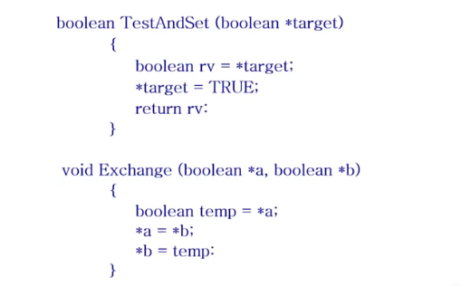

封装成了机器指令

进入和退出临界区：

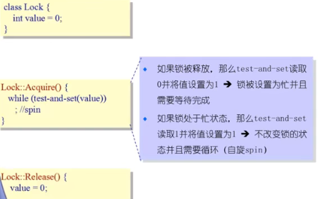

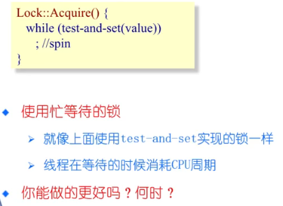

进程等待事件可以去睡眠：

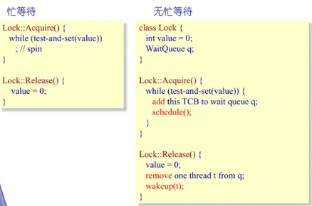

临界区时间很短：忙等，上下文切换少

临界区时间长：无忙等，切换时间影响较少

**通过exchange实现临界区的进入/退出**

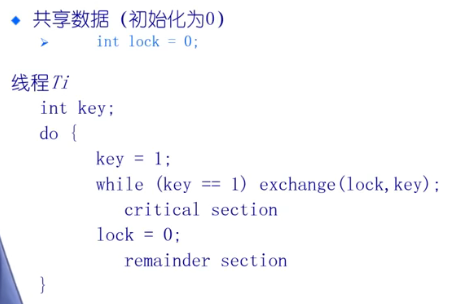

基于原子操作的**优点**：

​	1.适用于单处理器或者共同主存的多处理器中任意数量的进程

​	2.简单并且容易证明

​	3.可以用于支持多临界区

**缺点：**

​	1.忙等待消耗处理器时间

​	2.当进程离开临界区并且多个进程在等待的时候可能导致饥饿

​	3.死锁

​	如果一个低优先级的进程拥有临界区并且一个高优先级进程也需求，那么高优先级进程会获得处理器并等待临界区（低优先级的进程没机会释放锁，可以通过反转解决）

**锁是更高等级的编程抽象：**

​	1.互斥可以使用锁来实现

​	2.通常需要一定等级的硬件支持

**常用的三种实现方法：**

​	1.禁用中断（仅限于单处理器）

​	2.软件方法（复杂）

​	3.原子操作指令（单处理器或多处理器均可）

**可选的实现内容：**

​	1.有忙等待

​	2.无忙等待