# 死锁

流量只在一个方向

桥的每个部分可以看作一个资源

如果死锁，可能通过一辆车倒退可以解决（抢占资源和回滚）

如果发生死锁，可能几辆车都必须倒退

可能发生饥饿

## 一、死锁问题

一组阻塞的进程持有一种资源等待或许另一个进程所占有的一个资源

**eg.**系统有2个磁带驱动器；P1和P2各有一个，都需要另外一个

## 二、系统模型

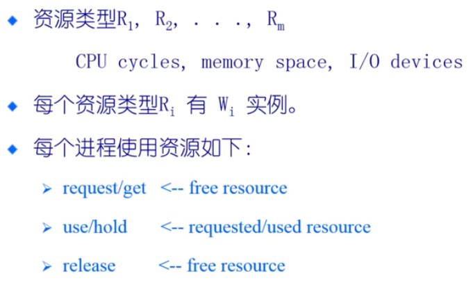

**可重复使用的资源**

​	1.在一个时间只能一个进程使用且不能被删除

​	2.进程获得资源，后来释放由其他进程重用

​	3.处理器，I/O通道，主和副存储器，设备和数据结构，如文件，数据库和信号量

​	4.如果每个进程拥有一个资源并请求其他资源，死锁可能发生

**使用资源**

​	1.创建和销毁

​	2.在I/O缓冲区的中断，信号，消息，信息

​	3.如果接受消息阻塞可能会发生死锁

​	4.可能少见的组合事件会引起死锁

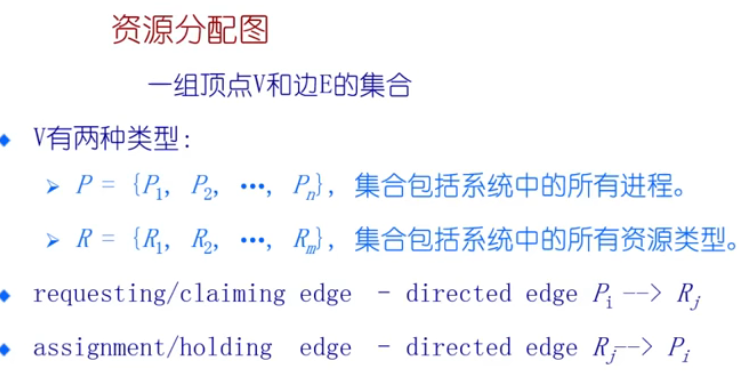

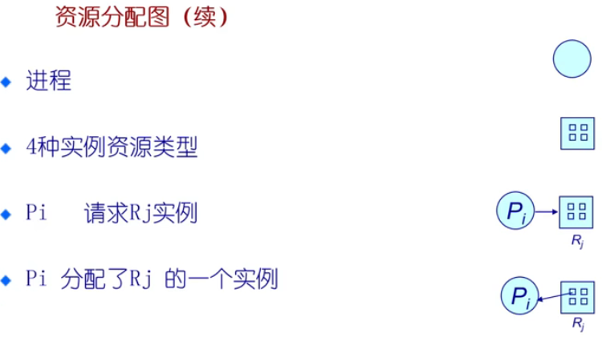

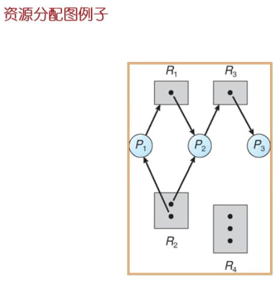

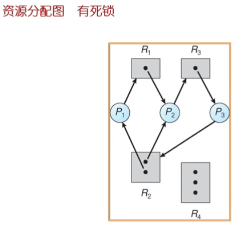

形成了一个环（大环和小环）

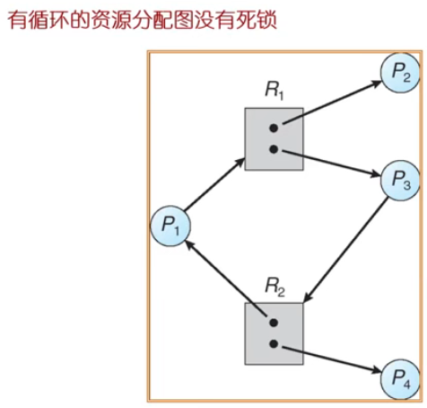

环不意味死锁的产生

#### **基本情况**

​	如果图中不包含循环==》没有死锁

​	如果图中包含循环==》

​				1.如果每个资源类只有一个实例，那么死锁

​				2.如果每个资源类有几个实例，可能死锁

## 三、死锁特征

**死锁可能出现，如果四个条件同时成立**

​	1.互斥：在一个时间只能有一个进程使用资源

​	2.持有并等待：进程保持至少一个资源正在等待获取其他进程持有的额外资源

​	3.无抢占：一个资源只能被进程自愿释放，进程已经完成了它的任务之后

​	4.循环等待：存在等待进程集合{P0,P1，...，PN}

## 四、死锁处理方法

​	1.确保系统永远不会进入死锁状态

​	2.运行系统进入死锁状态，然后恢复

​	3.忽略这个问题，假装系统中从来没有发生死锁；用于大多数操作系统，包括UNIX

**约束会影响性能，从上到下，约束降低**

### 	1.deadlock Prevention	（死锁预防）

​	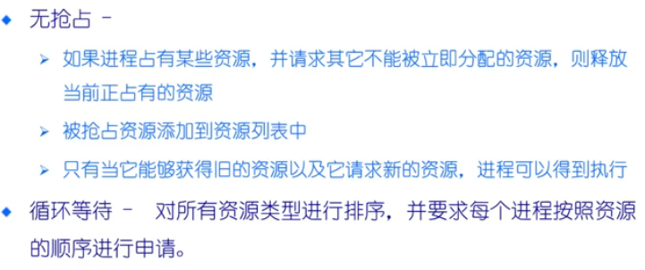

### 	2.deadlock avoidance		（死锁避免）

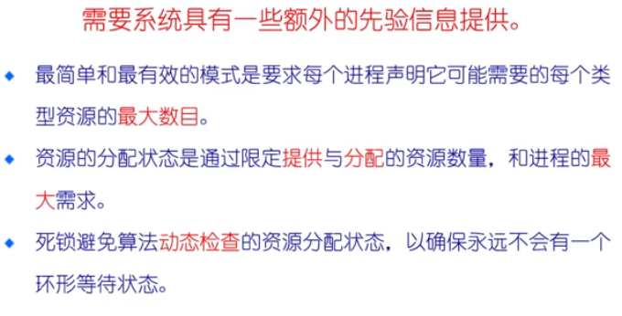

申请资源时审核

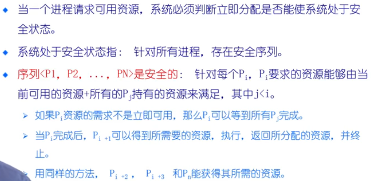

需要把序列找出来，不会有环形等待状态

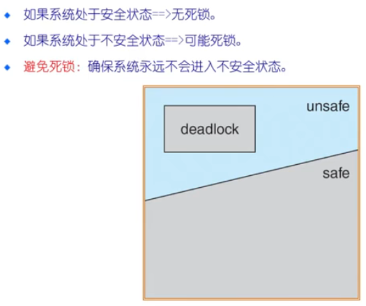

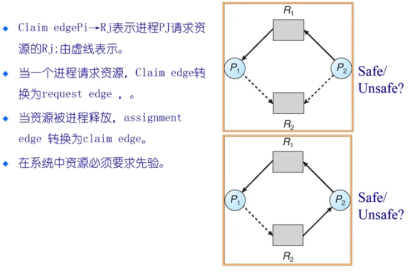

#### 银行家算法

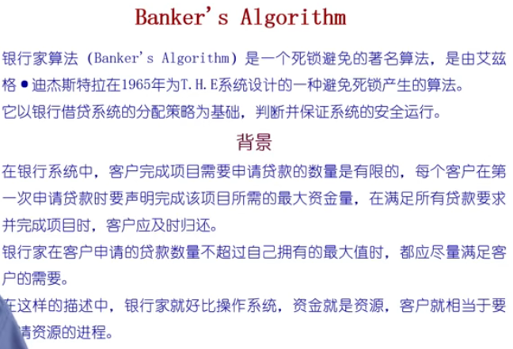

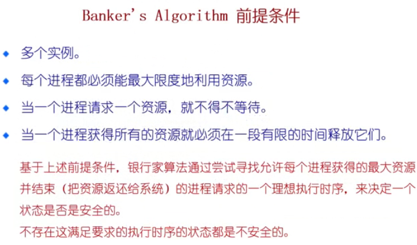

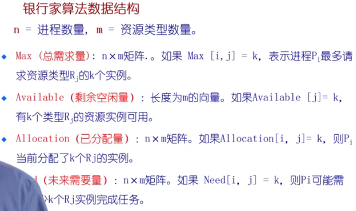

​           **Need[i,j]=Max[i,j]-Allocation[i,j]**

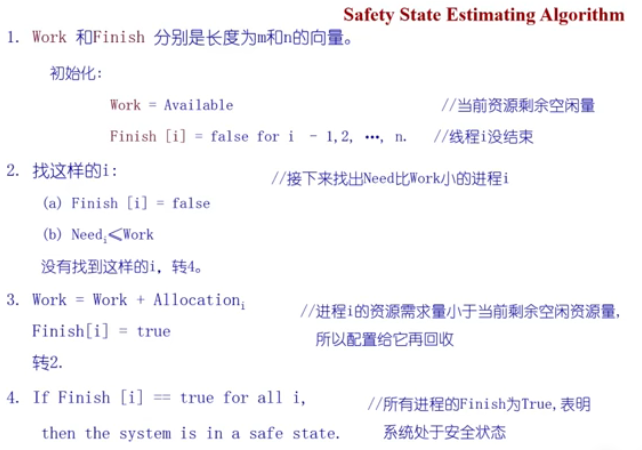

比较向量

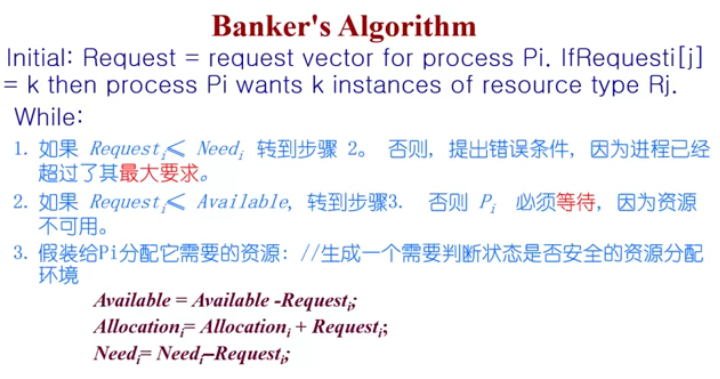

​		然后CALL Safety State Estimating Algorithm

​			·如果返回safe，则将资源分配给Pi

​			·如果返回unsafe，Pi必须等待，旧的资源分配状态被恢复

**例子1：**

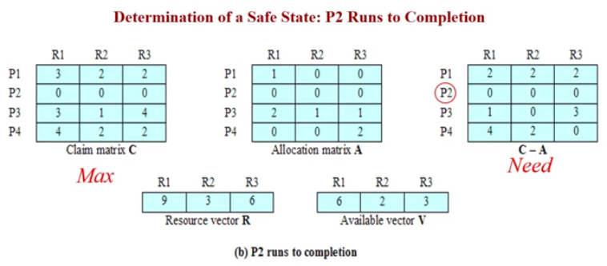

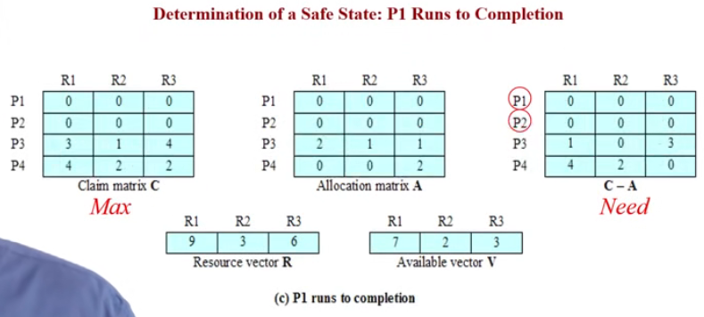

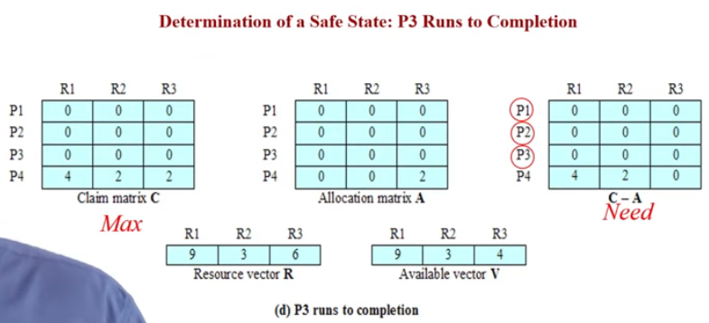

找到序列P2,P1,P3,P4   =>Safe state

**例子2：**   安全

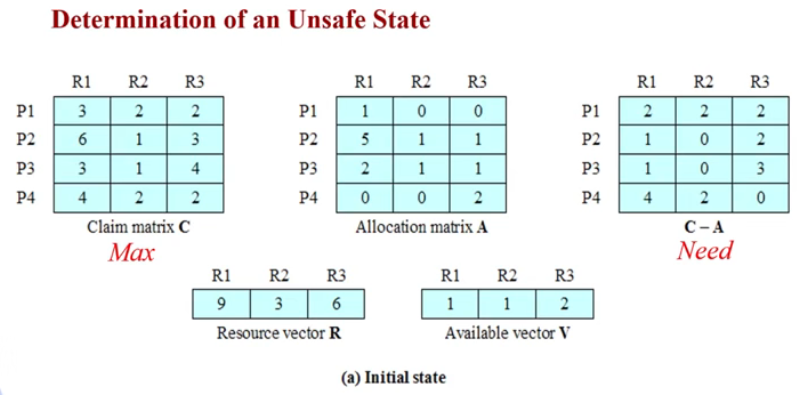

**例子3： **   不安全

**假定分配后状态按是否安全**

### 	3.deadlock detection		（死锁检测）

​		**允许系统进入死锁状态**

​		**死锁检测算法**

​		**恢复机制**

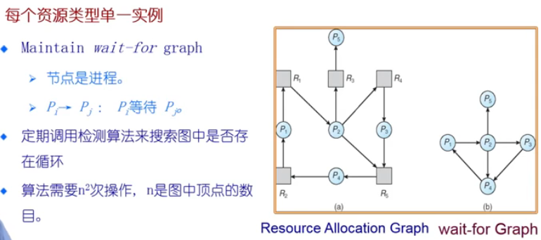

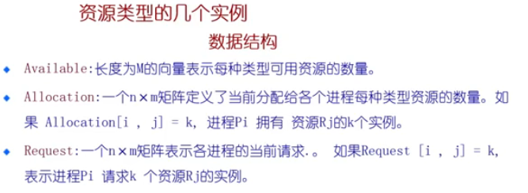

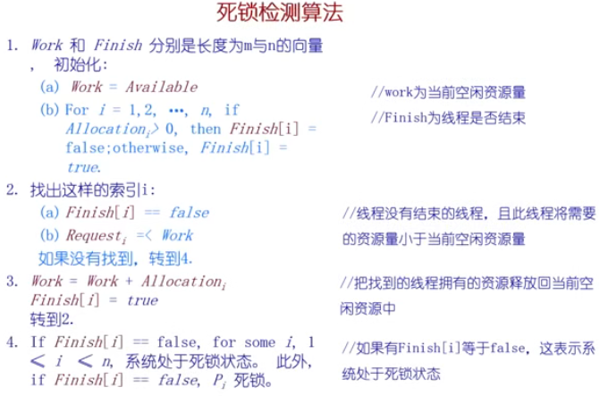

定期执行看是否有环，**算法需要O（m*n^2）操作检测系统处于死锁状态**

银行家算法需要知道最大需求，一般很难获取

**死锁检测和死锁避免在单机中很少使用，主要用于调试**

**例子1：**

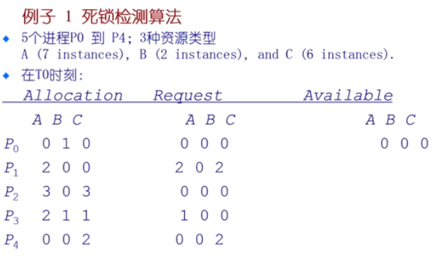

**例子2：**

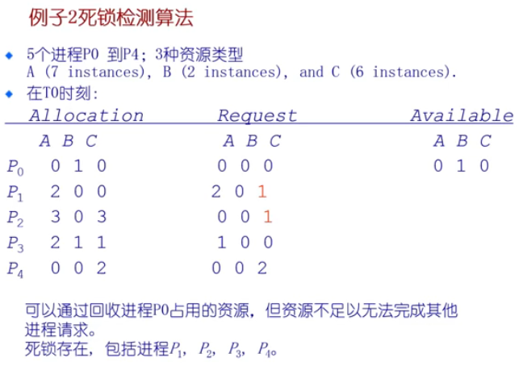

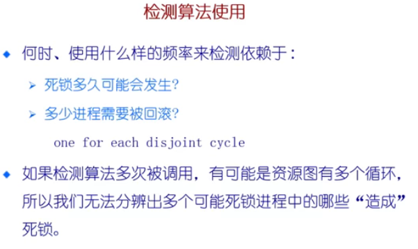

### 	4.recovery from deadlock		（死锁恢复）

回滚：

**终止所有的死锁进程**

**在一个时间内终止一个进程直到死锁消除**

**终止进程的顺序应该是：**

​		1.进程的优先级

​		2.进程运行了多久以及需要多少时间才能完成

​		3.进程占用的资源

​		4.进程完成需要的资源

​		5.多少进程需要被终止

​		6.进程是交互还是批处理

资源抢占：

**选择一个受害者——最小的成本**

**回滚——返回到一些安全状态，重启进程到安全状态**

**饥饿——同一进程可能一直被选作受害者，包括回滚的数量**

实用的办法：鸵鸟不理，然后恢复

