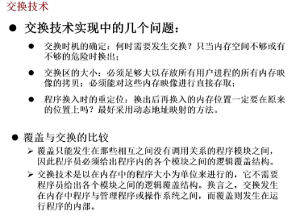
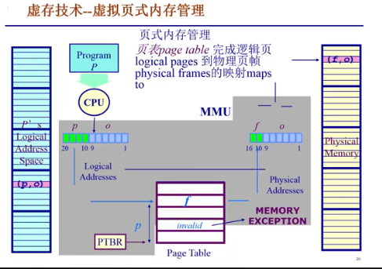
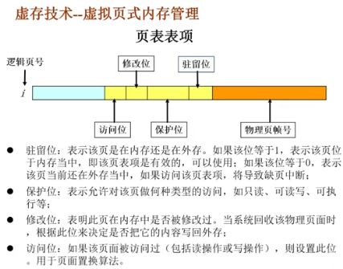
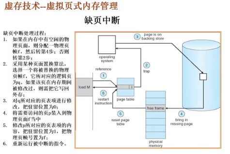

# 虚拟内存

## 1.起因

## 2.覆盖技术

**目标：**在较小的可用内存中运行较大的程序。常用于多道程序系统，与分区存储管理配合使用

**原理：**

把程序按照其自身逻辑结构，划分为若干个功能上相对独立的程序模块

那些不会同时执行的模块共享同一块内存区域，按时间先后来执行

必要部分(常用功能)的代码和数据常驻内存；

可选部分(不常用功能)在其他程序模块中实现，平时存放在外村中，在需要用时才装入内存；

不存在调用的关系的模块不必同时装入到内存，从而可以相互覆盖，即这些模块共用一个分区

缺点：1.设计开销，程序员人工划分并确定各个模块之间的覆盖关系

​            2.覆盖模块从外存装入内存，实际上是以时间延长来换取空间节省

## 3.交换技术(操作系统进行管理)

目标：多道程序在内存中时，让正在运行的程序或需要运行的程序获得更多的资源

方法：1.可将暂时不能运行的程序送到外村，从而获得空闲内存空间

​            2.操作系统把一个进程的整个地址空间的内容保存到外存中(换出swap out)，而将外存中的某个进程的地址空间读入道内存中(换入swap in)。换入换出内容的大小为整个**程序**的地址空间

 问题：1.交换时机的确定，何时需要发生交换？只当内存空间不够或有不够的危险时换出

​             2.交换区的大小，必须足够大以存放所有用户进程的所有内存映像的拷贝，必须能对这些内存映像进行直接存取

​             3.程序换入时的重定位，换出后再换入的内存位置一定要在原来的位置上吗？最好采用动态地址映射的方法(建立好页表，虚地址一样，物理地址不一样)

## 4.虚存技术

在内存不够用的情况下，可以采用覆盖技术和交换技术，但是：

1.覆盖技术：需要程序员自己把整个程序划分为若干个小的功能模块，并确定各个模块之间的覆盖关系，增加了程序员的负担

2.交换技术：以进程作为交换的单位，需要把进程的整个地址空间都换进换出，增加了处理器的开销。

### 4.1目标

**目标：**

像覆盖技术那样，不是把程序的所有内存都放在内存中，因而能够运行比当前的空闲内存空间还要大的程序，但做得更好，由操作系统自动来完成，无需程序员的干涉

像交换技术那样，能够实现进程在内存与外存之间的交换，因而获得更多的空闲内存空间。但做得更好，只对进程的部分内容在内存和外村之间进行交换

### 4.2程序局部性原理

**程序的局部性原理：**(要求)

程序在执行过程中的一个较短时期，所执行的指令地址和指令的操作数地址，分别局限于一定区域。这可以表现为：

1.时间局部性：一条指令的一次执行和下次执行，一个数据的一次访问和下次访问都集中在一个较短时期内；

2.空间局部性：当前指令和邻近的几条指令，当前访问的数据和邻近的几个数据都集中在一个较小区域内。

   C语言中按行优先放置.

### 4.3基本概念

  **可以在页式或段式内存管理的基础上实现**

 1.在装入程序时，不必将其全部装入到内存，而只需将当前需要执行的部分页面或段装入到内存，就可让程序开始执行

2.在程序执行过程中，如果需执行的指令或访问的数据尚未在内存(称为缺页或缺段)，则由处理器通知操作系统将相应的页面或段调入到内存，然后继续执行程序

3.操作系统将内存中暂时不使用的页面或段调出保存在外存上，从而腾出更多空闲空间存放将要装入的程序以及将要调入的页面或段

### 4.4基本特征

①大的用户空间：通过把物理内存与外存相结合。如32位的虚拟地址理论上可以访问4GB，而可能计算机上仅有256M的物理内存，但硬盘容量大于4GB

②部分交换：与交换技术相比，虚拟存储的调入和调出是对部分虚拟地址进行的

③不连续性：物理内存分配的不连续，虚拟地址空间使用的不连续

### 4.5虚拟页式内存管理（实现方式）

靠页表维护映射关系，页表项存储除了页帧号，还有存在性。

大部分虚拟存储系统都采用虚拟页式存储管理技术，即在页式存储管理的基础上，增加请求调页和页面置换功能。

**基本思路：**

当一个用户程序要调入内存运行时，不是将该程序的所有页面都装入内存，而是只装入部分的页面，就可启动程序运行。

在运行过程中，如果发现要运行的程序或要访问数据不在内存，则向系统发出缺页中断请求，系统在处理这个中断时，将外存中相应的页面调入内存，使得该程序能够继续运行

#### 后备存储：backing store（二级存储）

**在何处保存未被映射的页？**

1.能够简单地识别在二级存储器中的页

2.交换空间（磁盘或者文件）：特殊格式，用于储存未被映射的页面

**概念：**1.一个虚拟地址空间的页面可以被映射到一个文件（在二级存储中）的某个位置

   		 2.代码段：映射到可执行二进制文件

​			3.动态加载的共享库程序段：映射到动态调用的库文件

​			4.其他段：可能被映射到交换文件（swap file）

#### 虚拟内存性能

有效存储器访问时间effective memory access time(EAT)

EAT = 访问时间* 页表命中几率 + page fault处理时间*page fault几率

脏页：和磁盘数据不一致的页