# 进程管理

## 1.进程的描述

进程：一个具有一定工程的程序再一个数据集合上的一次动态执行过程

**包括：**

1.程序的代码

2.程序处理的数据

3.程序计数器中的值，指示下一条将运行的指令

4.一组通用寄存器当前值，堆，栈

5.一组系统资源（如打开的文件）

​    总之，进程包含了正在运行的一个程序的所有状态信息

### 1.1进程和程序的联系   多对多的映射关系

1.程序是产生进程的基础

2.程序的每次运行构成不同的进程

3.进程是程序功能的体现

4.通过多次执行，一个程序可对应多个进程，通过调用关系，一个进程可包括多个程序

### 1.2进程与程序的区别

进程是动态的，程序是静态的，程序是有序代码的集合；进程是程序的执行，进程有核心态/用户态

进程是暂时的，程序是永久的；进程是一个状态变化的过程，程序可以长久保存

进程与程序的组成不同；进程的组成包括程序、数据和进程控制块（进程状态信息）

### 1.3进程的特点

1.动态性：可动态地创建、结束进程；

2.并发性：进程可以被独立调度并占用处理机运行；**并发（一段时间内多个进程）并行（一个时刻多个进程）**，一个cpu没法实现并行

3.独立性：不同进程的工作不互相影响（通过页表可以使不同的程序访问不同的地址空间）

4.制约性：因访问共享数据/资源或进程间同步而产生制约。

​    **程序=算法+数据结构**

描述进程的数据结构：进程控制块(PCB);操作系统为每个进程都维护了一个PCB，用来保存与该进程有关的各种状态信息。

### 1.4进程控制结构

进程控制块：操作系统管理控制进程运行所用的信息集合。操作系统用PCB来描述进程的基本情况以及运行变化的过程，**PCB是进程存在的唯一标志**。

**使用进程控制块：**

1.进程的创建：为该进程生成一个PCB；

2.进程的终止：回收它的PCB

3.进程的组织管理：通过对PCB的组织管理来实现

**PCB含有以下三大类信息：**

1.**进程标识信息。**如本进程的标识，本进程的产生者标识(父进程标识)；用户标识

2.**处理机状态信息保存区。**保存进程的运行现场信息：

​	用户可见寄存器。用户程序可以使用的数据，地址等寄存器

​	控制和状态寄存器，如程序计数器（PC），程序状态字（PSW）

​	栈指针，过程调用/系统调用/中断处理和返回时需要用到它

3.**进程控制信息：**

​	调度和状态信息，用于操作系统调度进程并占用处理机使用。

​	进程间通信信息，为支持进程间的与通信相关的各种标识、信号、信件等，这些信息存在接收方的进程控制块中。

​	存储管理信息，包含有指向本进程映像存储空间的数据结构。

​	进程所用资源，说明由进程打开、使用的系统资源，如打开的文件等

​	有关数据结构链接信息，进程可以连接到一个进程队列中，或连接到相关的其他进程PCB

#### PBC的组织方式

链表：同一状态的进程其PCB成一链表，多个状态对应多个不同的链表

​		各状态的进程形成不同的链表：就绪链表、阻塞链表

索引表：同一状态的进程归入一个index表（由index指向PCB）,多个状态对应多个不同的index表

​		各状态的进行形成不同的索引表：就绪索引表、阻塞索引表

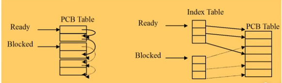

## 2.进程状态

#### 2.1进程的生命期管理

**进程创建：**

引起进程创建的3个主要事件：

1.系统初始化是

2.用户请求创建一个新进程

3.正在运行的进程执行了创建进程的系统调用

**进程运行：**

内核选择一个就绪的进程，让它占用处理机并执行

*为何选择？  *如何选择？

**进程等待：**

在以下情况下，进程等待（阻塞）：

1.请求并等待系统服务，无法马上完成

2.启动某种操作，无法马上完成

3.需要的数据没有到达

进程只能自己阻塞自己，因为只有进程自身才能知道何时需要等待某种事件的发生

**进程唤醒：**

唤醒进程的原因：

1.被阻塞进程需要的资源可被满足

2.被阻塞进程等待的事件到达

3.将该进程的PCB插入就绪队列

进程只能被别的进程或操作系统唤醒

**进程结束：**

1.正常退出（自愿的）

2.错误退出（自愿的）

3.致命错误（强制性的），比如访问其他进程的地址空间，被操作系统杀死

4.被其他进程所杀（强制性的）

#### 2.2进程状态变化模型

进程的三种基本状态：

​	进程在生命结束前处于且仅处于三种基本状态之一

不同系统设置的进程状态数目不同。

​	运行状态：当一个进程正在处理机运行时

​	就绪状态：一个进程获得了除处理机之外的一切所需资源，一旦得到处理机即可运行

​	等待状态（又称阻塞状态）：一个进程正在等待某一事件而暂停运行时。如等待某资源，等待输入/输出完成。

可能的状态如下：

NULL->NEW： 一个新进程被产生出来执行一个程序。

NEW->READY:当进程被创建完成并初始化后，一切就绪准备运行时，变为就绪状态。**是否会持续很久？**很快，一个PCB的初始化过程

Ready->Running:处于就绪状态的进程被进程调度程序选中后，就分配到处理机上来运行。

Running->Exit:当进程表示它已经完成或者因出错，当前运行进程会由操作系统作结束处理。

Running->Ready:处于运行状态的进程在其运行时，由于分配给它的处理机时间片用完而让出处理机。**由操作系统完成，管理着时钟**

Running->Blocked:当进程请求某样东西必须等待时。

Blocked->Ready:当进程要等待某事件到来时，它从阻塞状态变到就绪状态。**操作系统来完成**

#### 2.3进程挂起模型

**为什么挂起？**合理充分利用系统资源。

进程在挂起时，不占用内存空间。处在挂起状态的进程映像在磁盘上。

**阻塞挂起状态：**进程在外存并等待某事件的出现

**就绪挂起状态：**进程在外存，但只要进入内存，即可运行

**挂起：**把一个进程从内存转到外存；可能有以下几种情况：

阻塞到阻塞挂起：没有进程处于就绪状态或就绪进程要求更多内存资源时，会进行这种转换，以提交新进程或运行就绪进程；

就绪到就绪挂起：当有高优先级阻塞（系统认为很快就绪的）进程和低优先就绪进程时，系统会选择挂起低优先级就绪进程。

运行到就绪挂起：对抢先式分时系统，当有高优先级阻塞挂起进程因事件出现而进入就绪挂起时，系统可能会把运行进程转到就绪挂起状态。

**在外存时的状态转换：**

阻塞挂起到就绪挂起：当有阻塞挂起进程因相关事件出现时，系统会把阻塞挂起进程转换为就绪挂起进程。

**与挂起相关的状态转换：**解挂/激活：把一个进程从外存转到内存；可能有以下几种情况

就绪挂起到就绪：没有就绪进程或挂起就绪进程优先级高于就绪进程时，会进行这种转换

阻塞挂起到阻塞：当一个进程释放足够内存时，系统会把一个高优先级阻塞挂起（系统认为会很快出现所等待的事件）进程转换为阻塞进程；

**OS怎么通过PCB和定义的进程转台来管理PCB，帮助完成进程的调度过程？**

**状态队列：**由操作系统来维护一组队列，用来表示系统当中所有进程的当前状态；不同的状态分别用不同的队列来表示（就绪队列、各种类型的阻塞队列）；每个进程的PCB都根据它的状态加入到相应的队列当中，当一个进程的状态发生变化时，它的PCB从一个状态队列中脱离出来，加入到另一个队列。

## 3.线程

#### 3.1为什么使用线程

更小的能独立运行的基本单位——线程。

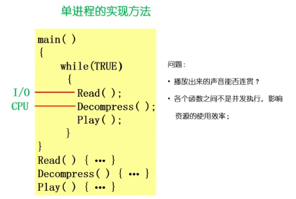

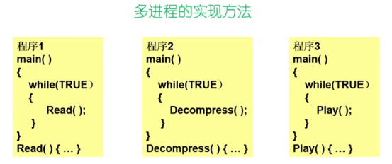

多进程问题：进程之间如何通信，共享数据？维护进程的系统开销较大；创建进程时，分配资源，建立PCB；撤销进程时，回收资源，撤销PCB；进程切换时，保存当前进程的状态信息。

**解决方式：**（提出一种新的实体，满足以下特性）

1.实体之间可以并发地执行；   2.实体之间共享相同的地址空间

#### 3.2什么是线程

线程Thread：进程当中的一条执行流程。

**理解进程：**（从资源组合的角度）进程把一组相关的资源组合起来，构成一个资源平台（环境），包括地址空间（代码段，数据段），打开的文件等各种资源。

（从运行的角度）代码在这个资源平台上的一条执行流程（线程）

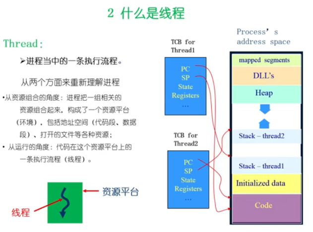

sp:堆栈      线程独立的信息：TCB控制

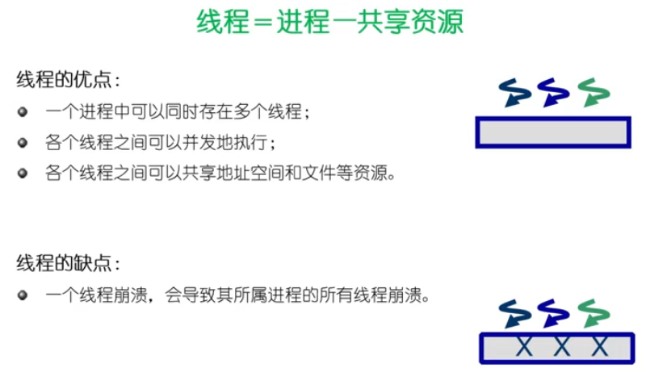

根据应用场景选择进程模式和线程模式

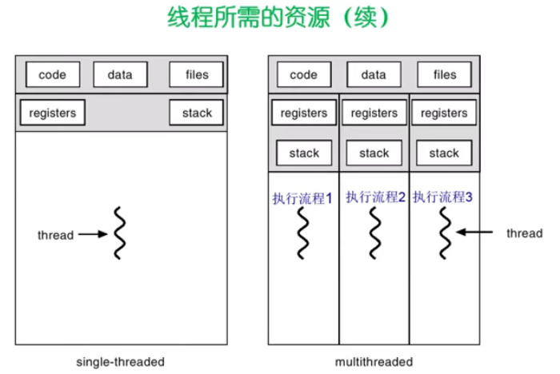

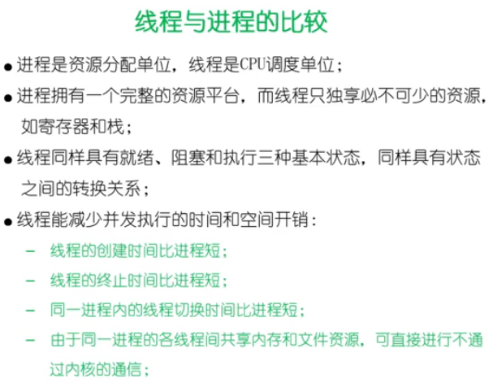

线程共享同一页表；进程切换要换页表和TLB等

## 4.上下文切换

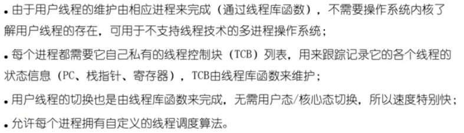

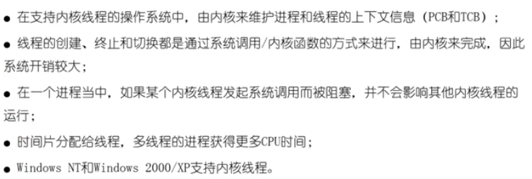

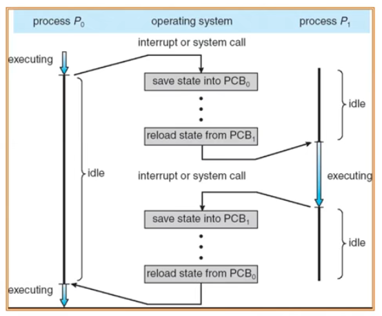

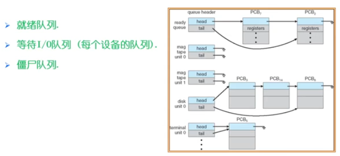

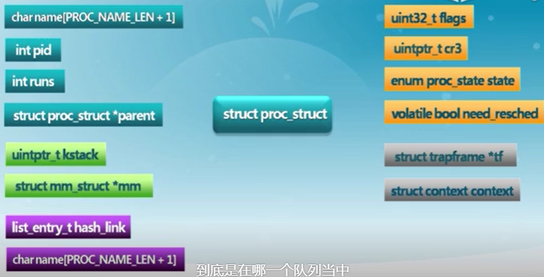

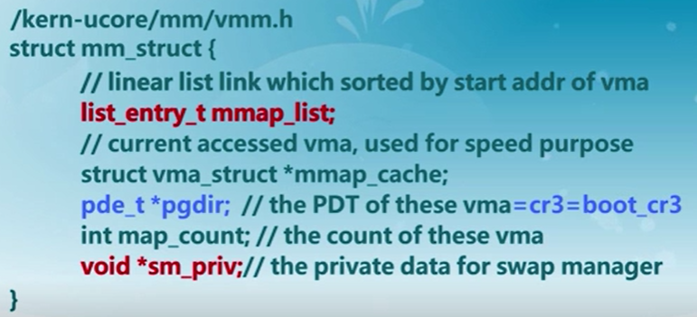

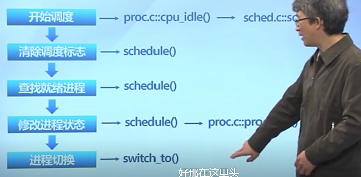

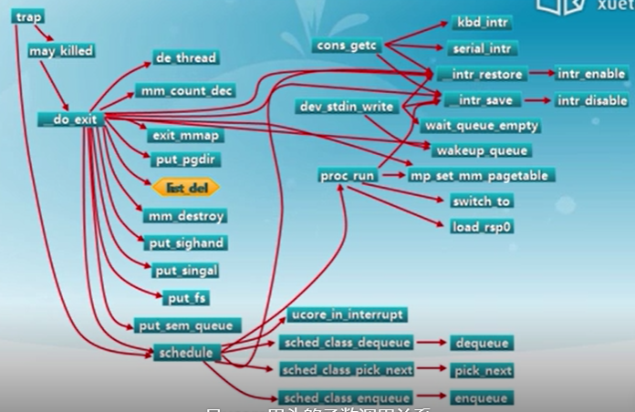

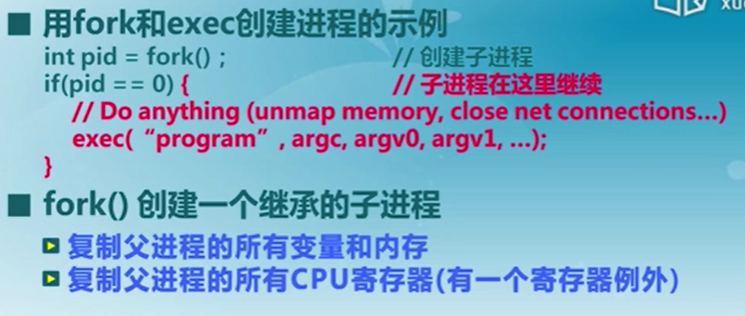

#### 4.2进程的执行

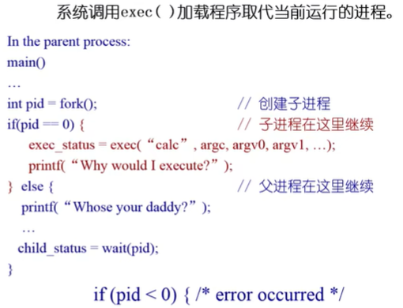

 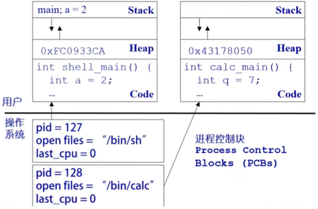

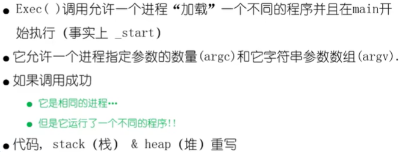

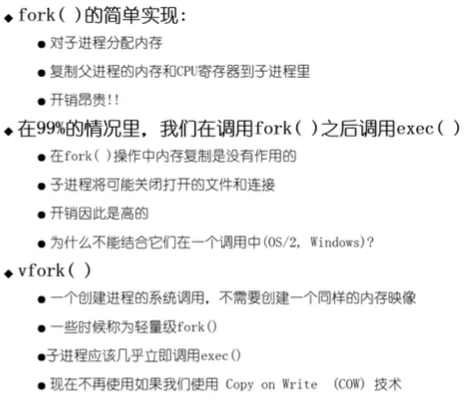

copy on write：写的时候再复制

#### 4.3进程的等待和终止

wait()系统调用是被父进程用来等待子进程的结束

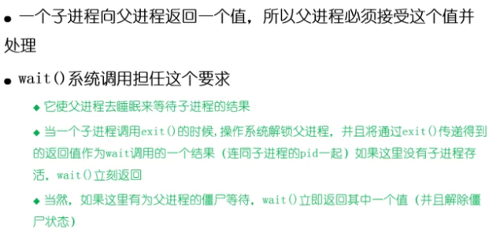

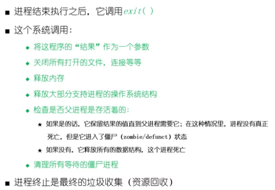

僵尸状态，exit()了但未wait()，没有被父进程回收

祖宗进程root定期扫描是否有处于僵尸进程，代替父进程进行wait（）回收

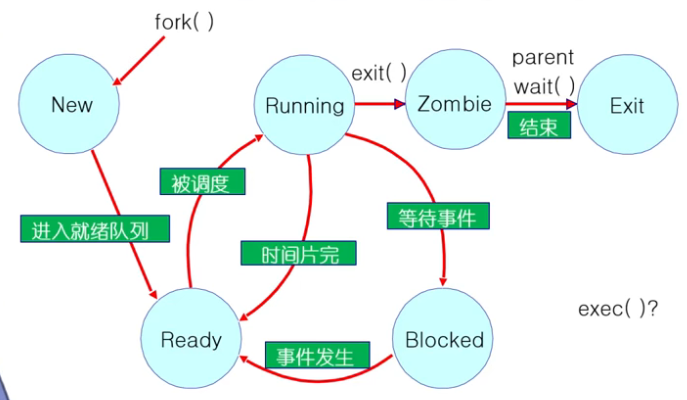

## 5.调度原则

#### 5.1背景

**上下文切换：**

切换CPU当前的任务，从一个进程/线程到另一个

保存当前进程/线程在PCB/TCB中的执行上下文（CPU状态）

读取下一个进程/线程的上下文

**CPU调度：**

从就绪队列中挑选一个进程/线程作为CPU将要运行的下一个进程/线程

调度程序：挑选进程/线程的内核函数（通过一些调度策略）

什么时候进行调度？ 从一个状态到另一个状态，会触发一次调度

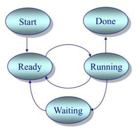

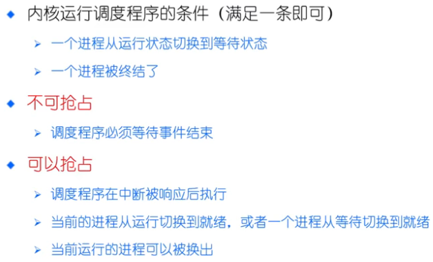

在用户态能否抢占？？在内核态能否抢占？？

#### 5.2调度原则

执行模型：程序在CPU突发和I/O中交替

​	每个调度决定都是关于在下一个CPU突发时将哪个工作交给CPU

​	在时间分片机制下，线程可能在结束当前CPU突发前被迫放弃CPU

**评价指标：**

CPU使用率；吞吐量（单位时间内完成的进程数量）；周转时间（一个进程从初始化到结束，包括所有等待时间所花费的时间）；等待时间（进程在就绪队列中的总时间）；响应时间（从一个请求被提交到产生第一次响应所花费的总时间）

#### 5.3调度算法

**公平的重要性**与不同定义

1.FCFS    先来先服务 

简单；  	平均等待时间波动较大；花费时间少的任务可能排在花费时间长的任务后面；可能导致I/O和CPU之间的重叠处理（CPU密集型进程会导致I/O设备闲置时，I/O密集型进程也在等待）

2.SPN(SJF)    SRT   短进程优先（短作业优先） 短剩余时间优先

​	可以是可抢占或者不可抢占的    ；可抢占：Shortest-Remaining-Time(SRT) 最短剩余时间，有新来的

可能导致饥饿：连续的短任务流使长任务饥饿；短任务可用时的任何长任务的CPU时间都会增加平均等待时间；  **需要预知未来**

3.HRRN   最高响应比优先

 在SPN调度的基础上改进；不可抢占；关注进程等待时间；防止无限期推迟

选择R最高的进程，R=（等待+执行）/执行

**需要预知未来**

4.Round Robin  轮循

规定一个时间片长度；

RR花销：额外的上下文切换；

时间量子太大（时间片不好设置）一般千分之一s：等待时间过长，极限情况退化成FCFS

时间量子太大：反应迅速，但是.....；吞吐量由于大量的上下文切换开销收到影响

目标：选择合适的时间量子，经验规则：维持上下文切换开销处于1%以内

**优化方案：**  （多级队列）

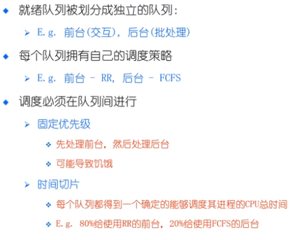

5.MULTILEVEL Feedback Queues   多级反馈队列

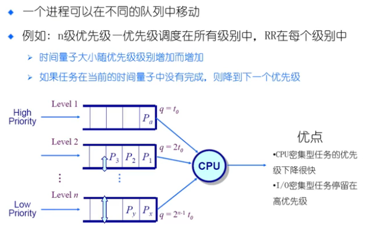

6.Fair Share Scheduling 公平共享调度

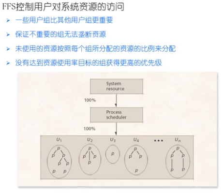

面向服务器，多人共用；  在**用户级别**实现资源公平

**评价：**

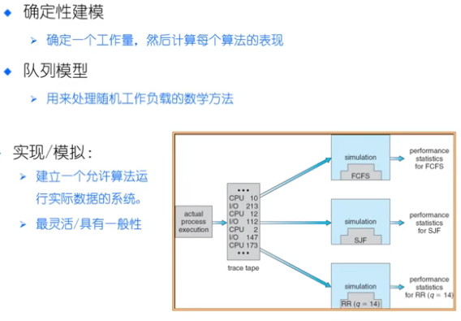

#### 5.4实时调度

定义：正确性依赖于其时间和功能两方面的一种操作系统

性能指标：时间约束的及时性；速度和平均性能相对不重要

主要特性：时间约束的可预测性

**强实时系统：**需要在保证的时间内完成重要的任务，必须完成

**弱实时系统：**要求重要的进程的优先级更高，尽量完成，并非必须

**任务（工作单元）**：一次计算，一次文件读取，一次信息传递等等

**属性：**取得进展需要的资源，定时参数

静态优先级调度；动态优先级调度

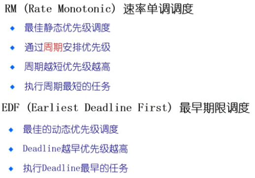

#### 5.5多处理器调度

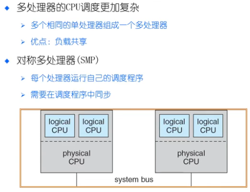

#### 5.6优先级反转

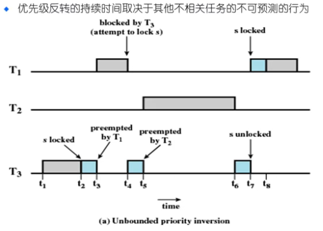

蓝色为访问共享资源；资源锁没有被释放

**解决：**

（1）优先级继承

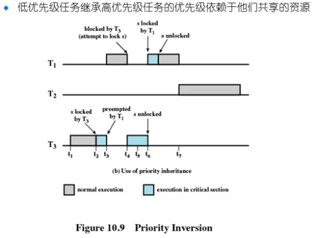

（2）优先级天花板协议，资源也定优先级

