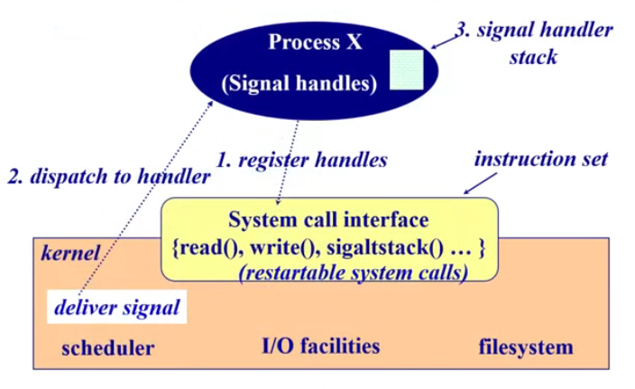
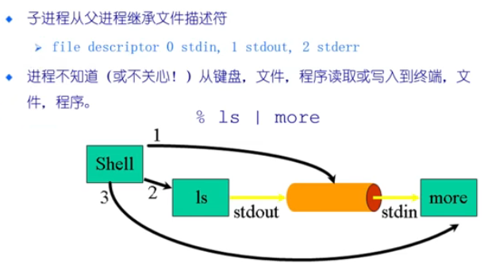
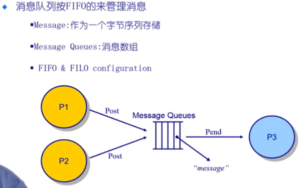
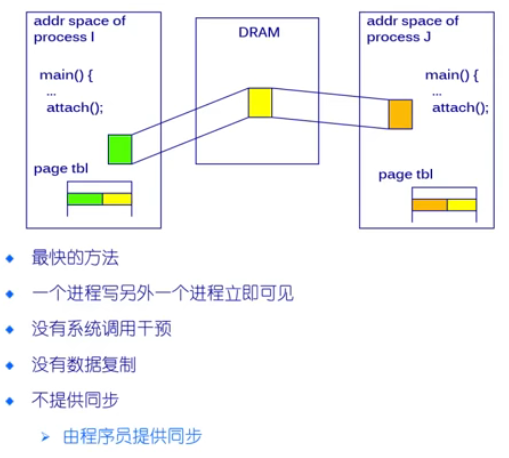

# 进程间通信IPC

## 一、概述

从发送路径：直接通信(中间一个share)，间接通信(kernel转发)

从另一种特征：阻塞和非阻塞

#### 直接通信

   必须正确命名对方：

send（p,message）   发送信息到进程P

receive(Q,message)	从进程Q接受消息

  **通信链路的属性：**（需要操作系统的支持来建立链路）

​		1.自动建立链路

​		2.一条链路恰好对应一对通信进程

​		3.每对进程之间只有一个链接存在	

​		4.链接可以是单向的，但通常为双向的

​		每对进程之间只有一个链接存在，自动建立链路，链接可以单向通常双向

#### 间接通信（中间节点为一个共享资源）

**定向从消息队列接受消息**：

​		1.每个消息队列都有唯一ID；

​		2.只有他们共享了一个消息队列，进程才能够通信

**通信链路属性：**

​		1.只有进程共享一个共同的消息队列，才建立链路；

​		2.链接可以与许多进程相关联；

​		3.每对进程可以共享多个通信链路；

​		4.链接可以是单向或双向

**操作：**创建一个新的消息队列；通过消息队列发送和接受消息；销毁消息队列

**定义：**

​		send(A,message)  	 发送消息到队列A

​		receive(A,message)		从队列A接收消息

#### 阻塞（同步）

阻塞到消息完成

#### 非阻塞（异步）

收到消息或没有，不等

#### 通信链路缓冲

队列的消息被附加到链路：可以是以下3种方式之一：（缓存多少的问题，发的快收的慢）

1.0容量：发送方必须等待接收方    ——类比同步，阻塞

2.有限容量：如果满，发送方必须等待；如果空，接收方等待

3.无限容量：分析模拟，不现实

## 二、信号signal

**软件**中断通知事件处理，example:SIGFPE,SIGKIL,SIGUSRI，SIGSTOP，SIGCONT

接收到信号发生：1.catch指定信号处理函数

​							   2.ignore依靠操作系统的默认操作

​	           				3.mask闭塞信号因此不会传送，可能是暂时的

不足：不能传输要交换的任何数据

​	 	**处理完后，回到被打断的程序重新执行**

**操作系统的实现：**

操作系统实现该功能：程序执行开始的时候，注册针对某类信号的handler自定义cathch方式给操作系统；作为系统调用发给操作系统

**产生信号时：**收到信号时，从内核态返回到用户态响应信号时，提前做好准备。返回的点改成信号处理函数的入口 ——》返回的用户空间的堆栈修改。**修改应用的程序的堆栈，很少这么做**

## 三、管道，数据交换（内核中的一块buffer）

把一个小程序的输出，重定向为一个小程序的输入——》形成流水线，靠一个竖线（管道，不知道会输入输出给谁），靠其他机制完成重定向

子进程从父进程继承文件描述符。shell：父进程创建管道

​		file descriptor 0 stdin，1 stdout，2 stderr

一个程序的输出重定向为一个程序的输入

shell创建两个子进程ls和more，共享一些资源（包括文件资源），同时做了一些设定，使ls输出变成Buffer，more的输入也变成了一个buffer   （|竖线的功能）

**管道的容量有限**

## 四、消息队列

管道需要有父子关系pipe；管道中的数据是字节流，没有结构化的表示形式

消息队列可以使多个不相干的进程传递数据；多传一，传递结构化的数据；有Buffer大小限制

消息队列按FIFO的来管理消息

​    Message:作为一个字节序列储存

​    Message Queues:消息数组

​	FIFO & FILO configuration

## 共享内存（直接通信的方式）

**进程**

​		1.每个进程都有私有地址空间

​		2.在每个地址空间内，明确地设置了共享内存段

**优点**

​		1.快速，方便地共享数据

**不足**

​		1.必须同步数据访问（通过同步互斥保护）

内存管理页表地支持

## Socket 套接字    ——（不讲）

进程间通信：
管道模型：比如cat xx.txt | grep -n 'xxx' 这个'|'可以看作一个单向的匿名管道，使得前后两个进程之间进行通信，前一个命名的输出作为后一个命令的输入，该管道使用结束则立即销毁。命名管道在linux中以文件的形式存在，只要访问该文件就可以实现任意两个进程间的通信，命名管道可以看作是是硬盘上存在的设备文件，所以打开需要使用open。
消息队列模型：比如生产者消费者模式，一端生产一端消费数据。遵循严格的先进先出。
共享内存：多用于传输一些大文件，如果采用管道或者消息队列传输大文件，涉及到重复拷贝，比较消耗性能，因此模拟多线程，在内存中开辟一块特殊的内存用于多个进程共享访问。也是进程间最高效的通信方式。
信号量机制：信号量可以看作一种数据操作锁，通过对临界资源的控制访问以管理进程之间的通信，PV原语操作。
socket：用于多个进程之间的网络传输。可以是单机多进程也可以是不同机器上的多进程通信。打开的socket在linux下也是以文件描述符fd存在。服务端创建套接字，绑定ip端口，监听端口号，等待客户端调用，客户端创建之后与服务端TCP三次握手建立连接完成，双方就可以发送和接收数据。