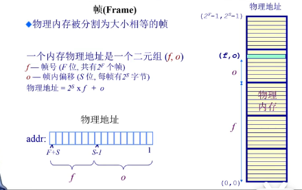
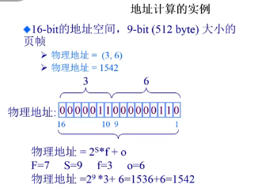
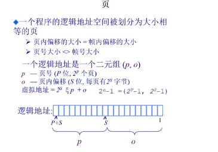
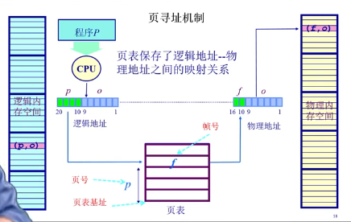
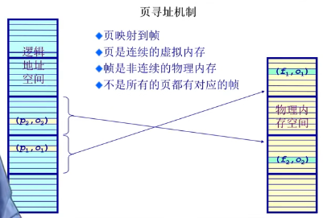
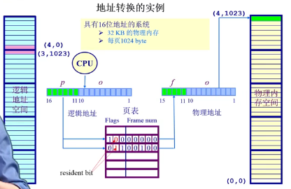
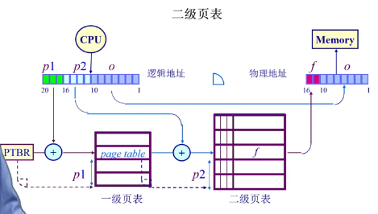
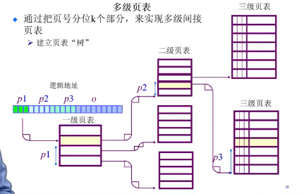

# 非连续内存分配

### 为什么需要非连续内存分配

连续内存分配的**缺点**：

1.分配给一个程序的物理内存是连续

2.内存利用率低

3.有外碎片、内碎片的问题

非连续分配的**优点**：

1.一个程序的物理地址空间是非连续的

2.更好的内存利用和管理

3.允许共享代码与数据(共享库等...)

4.支持动态加载和动态链接

非连续分配的**缺点**：

如何建立虚拟地址和物理地址之间的转换：硬件方案和软件方案(单独软件开销太大)

**硬件方案**：分段，分页

### 分段：更好的分离和共享

程序的分段地址空间，分段寻址方案

**段访问机制：**

一个段：一个内存”块“

程序访问内存地址需要：一个2维的二元组(一段号s,一段内偏移addr)

①段寄存器s+地址寄存器addr②单地址实现s+addr

**硬件实现方案**

操作系统建立段表

### 分页

分页地址空间，页寻址方案

最大区别是：段的尺寸可变，页的大小固定

划分物理内存至固定大小的帧：大小是2的幂

划分逻辑地址空间至相同大小的页

建立方案：转化逻辑地址pages为物理地址frames  ——页表，MMU/TLB

#### 帧frame

物理内存被分割为大小相等的帧 

一个内存物理地址是一个二元组(f,o)

f——帧号(F位，共有2F个帧)

o——帧内偏移(S位，每帧有2S字节)

#### 页：逻辑地址空间被划分为大小相等的页

P和F可以不一样

#### 

#### 页寻址机制

page table:由页号查帧号，一个大的数组  (base页表的起点)  **由操作系统建立**：操作系统初始化时就建立好了

## 页表

每个运行的程序都有一个页表：属于程序运行状态，会动态变化；PTBR：页表基址寄存器

存在项，可能不存在这个物理帧

#### 分页机制的性能问题

问题：访问一个内存单位需要2次内存访问：获取页表项，访问数据

页表可能非常大：64位机器如果每页1024字节，那么一个页表的大小会是多少？

**如何处理？**       缓存(解决时间问题)；间接访问(解决空间问题)

CPU中的快表**TLB**：缓存近期访问的页帧转换表项，如果TLB命中，物理页号可以很快被获取；如果TLB未命中，对应的表项被更新到TLB

 **二级页表**

将page num分成两部分

一级页表存二级页表的起始地址  ，二级存frame num

使得没有映射关系就不占用内存了

**多级页表**

时间换空间

### 反向页表

不和逻辑地址空间捆绑，和物理地址空间建立对应关系

**原因：**

1.有大地址空间(64bits),前向映射页表变得繁琐

2.不是让页表与逻辑地址空间的大小相对应

**办法：**

#### **基于页寄存器的方案：**以页帧号为索引，得到页号

每个帧和一个寄存器关联，寄存器内容包括：

​         此帧是否被占用，对应的页号p，保护位

利：转换表的大小相对于物理内存来说很小

​        转换表的大小跟逻辑地址空间的大小无关

弊：需要的信息对调了，即根据帧号可找到页号

​        如何转换回来？即根据页号找到帧号

​        在需要在反向页表中搜索想要的页号

#### 基于关联内存的方案

设计实现开销大，需要放到cpu中

在反向页表中搜索一个页对应的帧号：

​    如果帧数较少，页寄存器可以被放置在关联内存中。

​    在关联内存中查到逻辑页号，成功：帧号被提取；失败：页错误异常

​    限制因素：大量的关联内存非常昂贵，难以在单个时钟周期内完成；耗电

#### 基于哈希查找的方案

