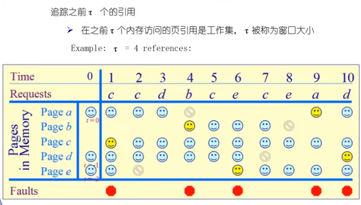
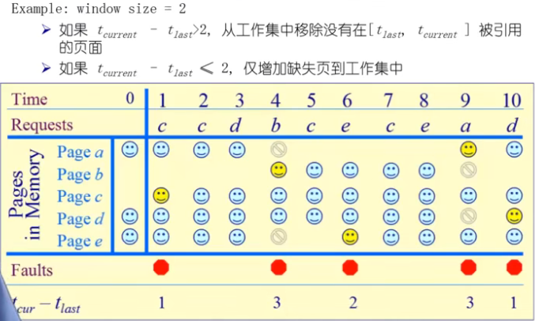

# 页面置换算法

## 1.功能与目标

**功能：**当缺页中断发生，需要调入新的页面而内存已满时，选择内存当中哪个物理页面被置换。

**目标：**尽可能减少页面的换进换出次数

**页面锁定：**用于描述必须常驻内存的操作系统的关键部分或时间关键的应用程序。**实现方法：**在页表中添加锁定标注位。

## 2.实验设置与评价方法

## 3.局部页面置换算法

#### 3.1最优页面置换算法opt

当缺页中断发生时，对于保存在内存当中的每一个逻辑页面，计算在他下一次访问之前，还需等待多长时间，,从中选择等待时间最长的那个，作为被置换的页面。

**这是一种理想情况，在实际系统中是无法实现的。可作为其他算法的性能评价的依据**

#### 3.2先进先出算法fifo

选择在内存中**驻留时间**最长的页面并淘汰之。系统维护着一个**链表**，记录了所有位于内存当中的逻辑页面。链首页面的驻留时间最长，链尾页面的驻留时间最短。缺页中断时，把链首页面淘汰出局，并把新的页面添加到链表的末尾。

**性能较差：**调出的页面有可能是经常要访问的页面，并且有**Belay现象**，FIFO算法很少单独使用

#### 3.3最近最久未使用算法lru

缺页中断发生时，选择最久未使用的那个页面，并淘汰之。

**对最优页面置换算法的一个近似，**依据是程序的**局部性原理**。

**实现方式①：**

系统维护一个页面链表，最近刚刚使用过的页面作为首节点，最久未使用的页面作为尾节点。每一次访问内存时，找到相应的页面，把它从链表移动到链首。每次缺页中断时，淘汰链表末尾的页面。

**实现方式②：**

设置一个活动页面栈，当访问某页时，将此页压入栈顶，然后去除栈内相同的页号。当需要淘汰页面时，选择栈底的页面。

LRU算法需要记录各个页面使用时间的先后顺序，开销比较大。

#### 3.4时钟页面置换算法clock

LRU的近似，对FIFO的一种改进：

**基本思路：**

需要用到页表项当中的访问位，当一个页面被装入内存时，把该位初始化为0.然后如果这个页面被访问(读/写),则把该位置为1；(通过硬件进行置1)

把各个页面组织成环形链表(类似钟表面)，把指针指向最老的页面(最先进来)

发生缺页中断时，考察指针所指向的最老页面，若它的访问位为0，立即淘汰；若访问位为1，则把该位置为0，然后指针往下移动一格。如此下去，直到找到被淘汰的页面，然后把指针移动到它的下一格。

这里有一个巨大的代价来替换“脏”页；

修改clock算法，使它允许脏页总是在一次时钟头扫描中保留下来(同时使用脏位和使用位来指导置换，**二次机会法**)

#### 3.5最不常用算法lfu

缺页中断发生时，选择访问次数最少的那个页面，并淘汰之

**实现方法：**对每个页面设置一个访问计数器，在发生缺页中断时，淘汰计数值最小的那个页面。

LRU和LFU的区别：**LRU**考察多久未访问；**LFU**考察访问频度。(解决方法：定期把次数寄存器右移一位)

#### 3.6Belady现象

采用FIFO算法时，有时会出现分配的物理页面增加，缺页率反而提高的异常现象。

FIFO算法的置换特征与进程访问内存的动态特征是矛盾的，与置换算法的目标是不一致的(即替换较少使用的页面)，因此被它置换出去的页面并不一定是进程不会访问的

LRU符合**栈算法**的特点

#### 3.7LRU、FIFO和Colock的比较

## 4.全局页面置换算法

在程序运行的不同阶段，对物理页帧的需求变化，动态的；

没有满的时候，也会进行替换

#### 4.1工作集模型

如果局部性原理不成立，那么各种页面置换算法就没什么区别，也没什么意义。

如果局部性原理成立，那么**如何证明它的存在**？如何对它进行定量地分析？

**工作集：**一个进程当前正在使用地逻辑页面集合

工作集大小的变化：

**常驻集：**指在当前时刻，进程实际驻留在内存当中的页面集合。

 	工作集是进程在运行过程中固有的性质，而常驻集取决于系统分配给进程的物理页面数目，以及所采用的页面置换算法。

​	如果一个进程的整个工作集都在内存当中，即常驻集是工作集的子集，那么进程将很顺利地运行，而不会造成太多地缺页中断(直到工作集发生剧烈变动，从而过渡到另一个状态)

​	当进程常驻集的大小达到某个数目之后，再给它分配更多的物理页面，缺页率也不会明显下降

#### 4.2工作集页置换算法

没有产生缺页也根据工作集窗口进行置换。

#### 4.3缺页率置换算法

**可变分配策略：**常驻集大小可变。

例如：每个进程在刚开始运行的时候，先根据程序大小给它分配一定数目的物理页面，然后在进程运行过程中，再动态地调整常驻集地大小。

可采用 **全局页面置换**的方式，当发生一个缺页中断时，被置换的页面可以是在其他进程当中，各个并发进程竞争地使用物理页面。

优缺点：性能较好，但增加了系统开销。

具体实现:可以使用缺页率算法来动态调整常驻集的大小。

**缺页率：**缺页次数/内存访问次数 或 缺页的平均时间间隔的倒数。

**影响缺页率的因素：**页面置换算法；分配个进程的物理页面数目，页面本身的大小，程序的编写方法

**缺页率算法：**若运行的程序的缺页率过高，则通过增加工作集来分配更多的物理页面；若运行的程序的缺页率过低，则通过减少工作集来减少它的物理页面数。力图使运行的每个程序的缺页率保持在一个合理的范围内。

减少工作集时，会把时间内没访问的都清除

对页调整的时机不一样

